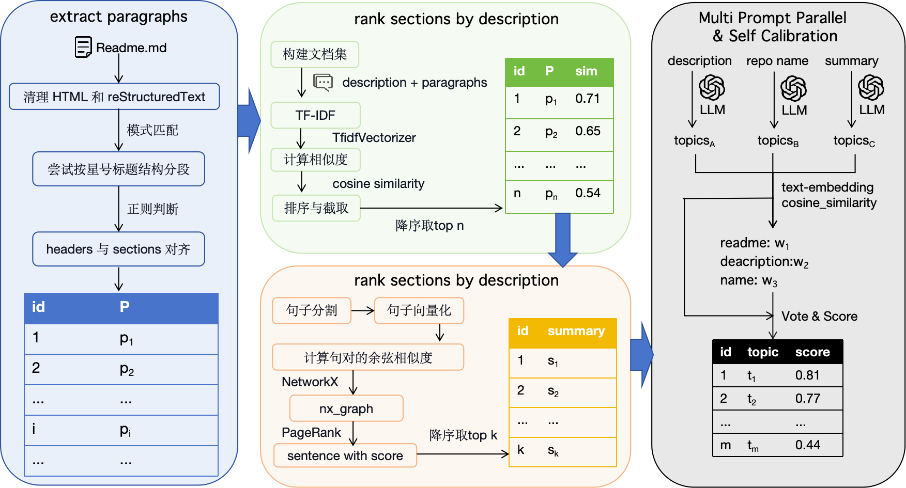
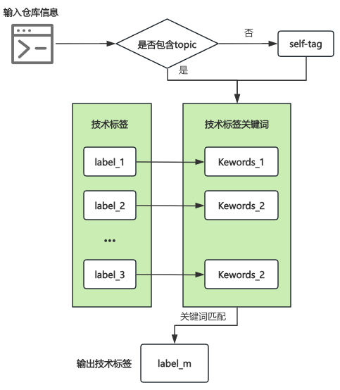
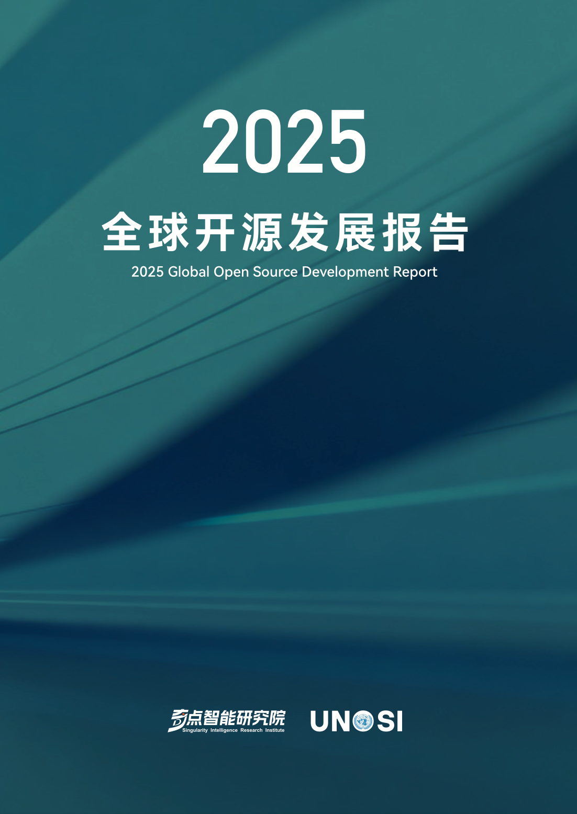
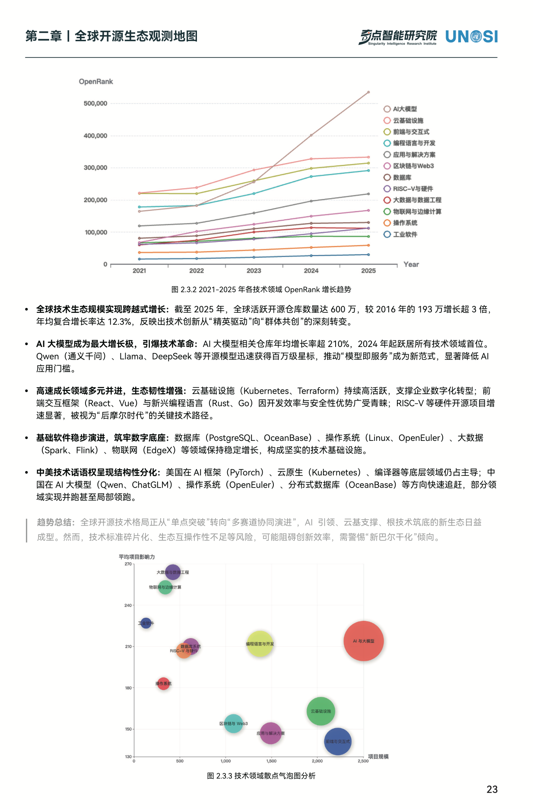

# OpenScope  
**LLM 驱动的 GitHub 仓库 Topic 自动生成与标签扩展框架**

---

## 项目简介

GitHub 作为全球最大的开源平台，其仓库数量持续增长，但大量项目缺乏有效的 Topic 标签。这不仅影响项目发现效率，也制约了开源生态的深度分析。

**OpenScope** 旨在解决这一问题：基于大语言模型（LLM）构建自动化、高准确率的 GitHub Topic 生成与技术标签扩展系统，为 [OpenDigger](https://github.com/X-lab2017/open-digger) 提供更完整、结构化的标签数据基础。

---

## 核心特性

- **无需训练模型**：直接调用主流 LLM（如 GPT-4、Claude、Qwen 等）即可使用  
- **多模态信息融合**：综合项目名称、描述、README 等文本生成语义一致的标签  
- **Self-Tag 方法**：多 Prompt 并行 + 自校准机制，提升标签质量与覆盖率，实现零样本学习方法的SOTA  
- **模块化设计**：支持灵活替换数据源、模型接口与评估策略  
- **开箱即用**：只需配置 LLM API Key，即可运行完整流程

---

## 项目结构

```
open-scope/
├── /data/             # LLM 生成 Topic 的测试与执行脚本
├── /dataset/          # 实验所用数据集
├── /topic-recommend/  # Self-Tag 方法核心实现
├── /label-gen/        # 技术标签生成模块
├── README.md
└── LICENSE
```

### 快速运行

```bash
# 测试 LLM 生成 Topic
python data/test_topic.py

# 执行 Run-Self-Tag 生成 Topic
python topic-recommend/run-self-tag.py

# 生成最终技术标签
python data/label-gen.py
```

---

## 方法概览

### 1. 数据采集与预处理

- 基于 **OpenRank 指标**（衡量项目活跃度与影响力）筛选 GitHub 前 10000 高质量仓库  
- 收集仓库名称、描述、README 及已有标签  
- 对 README 进行 **动态截断**，适配 LLM 上下文长度限制  

### 2. Self-Tag 框架（多 Prompt 并行 + 自校准）




*self-tag框架图*


1. **文本结构化**  
   - 使用 Markdown 解析器拆分 README 为章节、段落、代码块等  
   - 计算各章节“信息密度”（如实体密度、TF-IDF）

2. **关键片段抽取**  
   - 通过 TextRank 等轻量算法提取 Top-K 句  
   - 利用 LLM 对关键句做**一句话摘要**，压缩上下文

3. **多 Prompt 并行生成**  
   - **Prompt A（全局概要）**：基于项目整体内容推荐 ≤10 个 Topic  
   - **Prompt B（结构感知）**：结合章节结构推荐标签  
   - **Prompt C（关键词对齐）**：基于技术关键词推荐并评估匹配度  

4. **结果聚合与自校准**  
   - 三路结果投票计分  
   - 通过 LLM 二次校正：“剔除无关标签，补充遗漏项”  
   - 输出最终 Top-N 高置信度 Topic


### 3. 技术标签生成

- 先由 LLM 为各技术领域生成关键词库  
- 将 Self-Tag 生成的 Topic 与关键词库匹配  
- 匹配成功则赋予对应技术标签，完成结构化扩展



*标签生成流程图*

---

## 实验结果

### LLM 模型性能对比

| 模型    | P@3  | R@3  | F@3  | S@3  | P@4  | R@4  | F@4  | S@4  | P@5  | R@5  | F@5  | S@5  |
|---------|------|------|------|------|------|------|------|------|------|------|------|------|
| GPT     | 0.44 | 0.21 | 0.29 | 0.78 | 0.39 | 0.24 | 0.30 | 0.81 | 0.35 | 0.26 | 0.30 | 0.83 |
| DeepSeek| 0.51 | 0.24 | 0.32 | 0.84 | 0.45 | 0.27 | 0.34 | 0.87 | 0.41 | 0.30 | 0.35 | 0.88 |
| Claude  | 0.51 | 0.24 | 0.33 | 0.85 | 0.45 | 0.28 | 0.35 | 0.88 | 0.41 | 0.31 | 0.36 | 0.89 |
| Gemini  | 0.39 | 0.19 | 0.25 | 0.68 | 0.35 | 0.22 | 0.27 | 0.71 | 0.32 | 0.24 | 0.27 | 0.72 |
| Qwen    | 0.47 | 0.22 | 0.30 | 0.81 | 0.42 | 0.25 | 0.32 | 0.84 | 0.38 | 0.28 | 0.32 | 0.86 |

> P = Precision, R = Recall, F = F1, S = Success Rate（至少一个标签命中）

### 与基线方法对比（@Top-10）

| Models     | P@5  | R@5  | F1@5 | SR@5 | P@8  | R@8  | F1@8 | SR@8 | P@10 | R@10 | F1@10 | SR@10 | Avg. F1 | Avg. SR |
|------------|------|------|------|------|------|------|------|------|------|------|-------|-------|---------|---------|
| LR-TFIDF   | 0.42 | 0.35 | 0.35 | 0.91 | 0.33 | 0.42 | 0.37 | 0.94 | 0.29 | 0.44 | 0.35  | 0.95  | 0.36    | 0.92    |
| ZestXML    | 0.46 | 0.40 | 0.43 | 0.96 | 0.37 | 0.48 | 0.42 | 0.99 | 0.33 | 0.51 | 0.40  | 0.99  | 0.42    | 0.97    |
| **self-tag** | **0.50** | **0.45** | **0.47** | **0.98** | **0.41** | **0.52** | **0.46** | **1.00** | **0.37** | **0.55** | **0.44** | **1.00** | **0.47** | **0.99** |

> Self-Tag 在准确率和成功率上均显著优于传统方法。

### 不同方法的 LLM Token 使用量对比

| 方法                     | 输入 Tokens   | 输出 Tokens | 总 Tokens    | 相对 Token 成本 |
| ---------------------- | ----------- | --------- | ----------- | ----------- |
| 直接 LLM（GPT / Claude）   | ~1,000      | 100      | ~1,100      | 1.0×        |
| **self-tag(本方法)** | **150–200** | **100**   | **250–300** | **≈ 0.23×** |


### 估算推理成本对比

| 方法           | 单 README 成本    | 成本降幅         |
| ------------ | ------------------- | ------------ |
| 直接调用 LLM     | $0.01 – $0.05       | —            |
| **self-tag(本方法)** | **$0.002 – $0.006** | **↓ 70–80%** |


---
## 落地支撑

<p align="center">
  
  
</p>


## 许可证

本项目采用 [Apache License 2.0](LICENSE) 开源许可。
